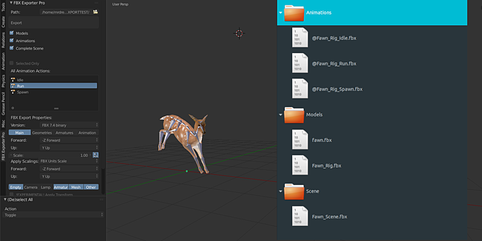

# Blender Fbx Exporter
Additional export features for blender fbx. Works wiht 2.79b
## Features
  -Export animation actions only without object to one file per action.\
  -You can select actions from the tool list.\
  -Export complete Scene as one file.\
  -Export all objects to one file per object.\
  -The fbx file sizes are smaller.\
  -In Unity3d the animations will be linked to object.
  
  
  
### Tasks:
- [ ] Blender 2.8 support
- [ ] Refactoring
- [ ] Texture export

## Contributing
Pull requests are welcome. For major changes, please open an issue first to discuss what you would like to change.
Please make sure to update tests as appropriate.

## License
[GPL](https://choosealicense.com/licenses/gpl-3.0/)
